## SUSTech CS307 Database Project1, Spring 2024

#### 小组成员：陈明志 12211414，邱天润 12210829

> 源码托管于 GitHub，将在项目 ddl 结束后基于 **MIT License** 协议开源，访问链接：
>
> https://github.com/Dilemma-CMZ/CS307-Project1

------

### 成员分工及贡献百分比

陈明志：

- 数据库建表设计

- Java数据筛选与导入

- Python和C++数据导入框架与编写
- Python和C++部分多线程优化以及disable trigger和entrigger的对比测试
- 不同的Data volume测试优化
- 项目相关的accuracy checking SQL语句编写
- 项目报告写作

邱天润：

- 数据库建表设计和E-R图绘制

- Java数据筛选与导入
- 基于Java的多种导入优化，如Batch、多线程等，并进行比较
- 多平台导入数据测试（macOS，Windows，Linux三平台）
- 进行非Postgres导入测试（OpenGauss，MySQL）
- 项目报告写作

贡献百分比**相同，均为 50%**。

### 项目源码文件夹结构：

```shell
├─ Distinct Volume Test
│  ├─ Definition.sql
│  ├─ gen.cpp
│  └─ load.py
├── JavaLoaders
│   ├── FullLoader.java
│   ├── FullLoaderMySQL.java
│   ├── LoaderNotes.md
│   ├── disable_triggers.sql
│   ├── disable_triggers_MySQL.sql
│   ├── enable_triggers.sql
│   ├── enable_triggers_MySQL.sql
│   ├── TestLoaders
│   │   ├── Loader1Awful.java
│   │   ├── Loader2Connect.java
│   │   ├── Loader3Prepare.java
│   │   ├── Loader4Transaction.java
│   │   ├── Loader5Batch.java
│   │   ├── Loader6Threads.java
│   │   └── LoaderControl.java
│   ├── Types
│   │   ├── Cards.java
│   │   ├── Passengers.java
│   │   └── Ride.java
│   ├── fastjson-1.2.79.jar
│   ├── mysql-connector-j-8.3.0.jar
│   ├── opengauss-jdbc-5.0.1.jar
│   ├── postgresql-42.2.5.jar
│   └── postgresql.jar
├── Python_Loader.py
├── C++_Loader.cpp
├── DDL.sql
├── DDL_MySQL.sql
├── SQLGenerator.java
└── report.pdf
```

- [report.pdf](report.pdf): 项目报告
- [DDL.sql](DDL.sql): 每个库的基本DDL信息
- [DDL_MySQL.sql](DDL_MySQL.sql): 每个库的基本DDL信息，MySQL语法改写版本
- [C++_Loader.cpp](C++_Loader.cpp): C++导入数据源代码
- [Python_Loader.cpp](Python_Loader.cpp): Python导入数据源代码
- [SQLGenerator.java](SQLGenerator.java): 以5个json文件作为输入，可以输出所有的SQL建表语句以及数据的插入
- [Query.sql](Query.sql): SQL查询语句
- [Distinct Volume Test](Distinct Volume Test): 
  - Definition.sql: 进行测试之前需要运行的sql语句
  - gen.cpp: 数据生成器
  - load.py: 导入数据脚本
- [JavaLoaders](/JavaLoaders): 
  - \*.jar: 导入所依赖的Java包
  - Types/\*: 导入数据对应的数据结构
  - TestLoaders/\*: 不同优化水准的Java导入数据源代码，以其中一个数据表为测试对象
  - FullLoader.java: 导入所有数据的Java源代码
  - FullLoader.java: 导入所有数据到MySQL的Java源代码
  - \*\_triggers\*.sql：用于Disable和Enable Triggers的SQL脚本
  

------

### Task 1: E-R Diagram

本小组使用 [drawio](https://www.diagrams.net/) 绘图工具，绘制本项目的 E-R 图，截图如下：

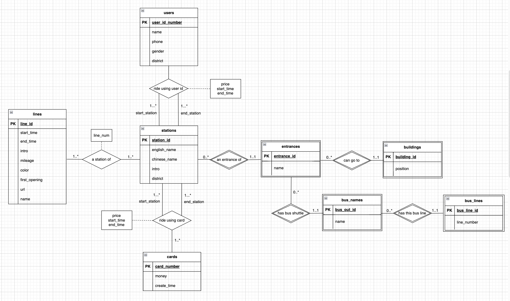


------

### Task 2: Relational Database Design

本项目使用 [`DDL.sql`](DDL.sql) 文件创建数据表，使用 `PostgreSQL`的 `DDL` 语法编写。（后续在MySQL导入中，使用`MySQL`的语法改写进行导入。）

#### 数据库设计

使用 [`DataGrip`](https://www.jetbrains.com/datagrip/) 创建数据表并全选后通过右键 `Diagram > Show Diagram` 显示如下数据表设计及关系。

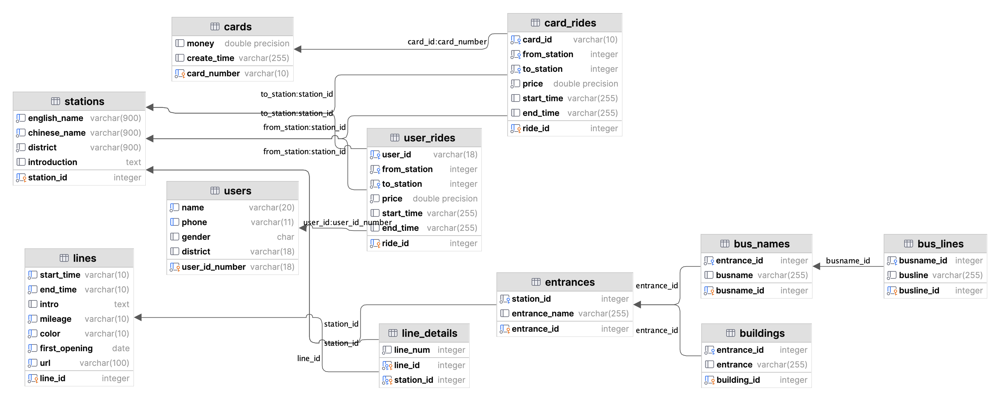

#### 设计思路及说明

##### 数据表及其各列含义说明

在整个项目中共创建了 11 个数据表，数据表和其中各列、外键的含义如下：

1. Lines 表存储地铁线路信息。包括地铁线的编号 Line_id（主键）、该地铁线路的起始时间 start_time、结束时间 end_time、介绍 intro、里程数 mileage、标注颜色 color、首次开通日期 first_opening、官方网址 url。

2. Stations 表存储地铁站点信息。包括站点编号 Station_id（主键）、英文名 English_name、中文名 Chinese_name、所在区域 District、简介 Introduction。

3. Line_details 表建立地铁线路和站点之间的关系。包括地铁线编号 Line_id（外键，参考 Lines.Line_id）、站点编号 Station_id（外键，参考 Stations.Station_id）、线路序号 line_num（表示站点在线路上的顺序）。

4. Entrances 表存储地铁站入口信息。包括入口编号 Entrance_id（主键）、站点编号 station_id（外键，参考 Stations.Station_id）、入口名称 Entrance_name。

5. Buildings 表存储与入口相关的建筑信息。包括建筑编号 Building_id、入口编号 Entrance_id（外键，参考 Entrances.Entrance_id）、入口名称 Entrance。

6. Bus_Names 表存储与入口相关的公交线路名称信息。包括公交线路名称编号 BusName_id（主键）、入口编号 Entrance_id（外键，参考 Entrances.Entrance_id）、公交线路名称 BusName。

7. Bus_Lines 表存储公交线路信息。包括公交线路编号 BusLine_id（主键）、公交线路名称编号 BusName_id（外键，参考 Bus_Names.BusName_id）、公交线路名称 BusLine。

8. Cards 表存储交通卡信息。包括卡号 Card_number（主键）、卡上的金额 Money、创建时间 Create_time。

9. Users 表存储用户信息。包括用户身份证号码 User_id_number（主键）、姓名 Name、电话号码 Phone、性别 Gender、所在区域 District。

10. User_Rides 表存储用户乘车信息。包括乘车编号 Ride_id（主键）、用户身份证号码 User_id（外键，参考 Users.User_id_number）、起始站点编号 From_station（外键，参考 Stations.station_id）、目的站点编号 To_station（外键，参考 Stations.station_id）、价格 Price、起始时间 Start_time、结束时间 End_time。

11. Card_Rides 表存储使用卡片的乘车信息。包括乘车编号 Ride_id（主键）、卡号 Card_id（外键，参考 Cards.Card_number）、起始站点编号 From_station（外键，参考 Stations.station_id）、目的站点编号 To_station（外键，参考 Stations.station_id）、价格 Price、起始时间 Start_time、结束时间 End_time。


##### 数据库构建的合理性

- **满足三大范式**
  - 通过示意图可以看到，每个数据表的每一列都是不可分割的，仅有一个值。

  - 每个数据表都有主关键字，且主关键字都是 `UNIQUE` 的，其它数据元素能和主关键字一一对应。

  - 通过设计外键连接，我们将同一数据表中具有“传递”关系的数据列设计成不同的表格进行设计，不存在非关键字段对任一候选关键字段的传递函数依赖。

  - 可见，按以上设计思想设计的数据库满足三大范式的要求。

- 满足项目要求文档所要求的其它详细注意点，如外键无环、Unique约束列等。

------

### Task 3: Data Import

#### Task 3.1 Basic Requirements

| 脚本名称 | 作者 | 描述 |
| ---------------- | ------ | ----------- |
| SQLGenerator.java   | 陈明志&邱天润 |   将Resources中的5个json文件作为输入，运行该脚本可以得到所有的建表语句以及插入内容的sql文件  |
| C++_Loader.cpp   | 陈明志 |  通过运行这个C++脚本可以导入所有的数据，并且里面有两种方式导入，一种是普通的导入，另外一种是通过控制互斥锁以及多线程优化后的导入（在Task 3.3.6中会有对比）     |
| Python_Loader.py | 陈明志 | 通过运行这个Python脚本可以导入所有的数据，并且里面有两种方式导入，一种是普通的导入，另外一种是运用Python`concurrent.futures`优化的多线程导入（在Task 3.3.6中会有对比）  |
| FullLoader.java | 邱天润 | 运行这个Java脚本可以导入所有的数据到Postgres或OpenGauss数据库中（在Task 3.3.6中会有对比） |
| FullLoader_MySQL.java | 邱天润 | 运行这个Java脚本可以导入所有的数据到MySQL数据库中 |

在处理数据的过程中，我们通过创造了中间文件的方式来处理数据。

我们首先使用`SQLGenerator.java`脚本将原始的JSON文件转换为SQL文件。这个脚本会读取JSON文件，然后生成相应的SQL语句（包括建表语句和插入数据的语句），并且会进行一定程度的数据清洗，比如对冗余的全角半角的空格进行的删除，以及对一些错误数据的人工纠正。

以下是我们的具体逻辑：

1. 使用一个for循环遍历所有的线路，并为每条线路生成一个SQL插入语句，将其插入到Lines表对应的SQL文件中。
2. 使用一个for循环遍历JSON对象中的所有站点，并为每个站点生成一个SQL插入语句，将其插入到Stations表对应的SQL文件中；同时为每个站点生成一个唯一的Station_id，保存在StationsMap中。
3. 对于每条线路，遍历其对应的站点信息，并为站点和线路的多对多关系建立联系，将这一联系信息其插入到Line_details表对应的SQL文件中。
4. 对于每个站点，遍历其对应的出口信息，并为每个出口生成一个SQL插入语句，将其插入到Entrances表对应的SQL文件中。
5. 对于每个站点的每个出口，遍历其对应的公交信息，并为每条公交信息生成一个SQL插入语句，将其插入到Bus_Names表对应的SQL文件中；将公交站对应的公交线路进行拆分解析，将其插入到Bus_Lines表对应的SQL文件中。
6. 对于每个站点的每个出口，遍历其对应的出口附近的建筑信息，并为每个出口生成一个SQL插入语句，将其插入到Buildings表对应的SQL文件中。
7. 读取一个JSON数组，将其转换为公交卡（Cards）对象列表，然后遍历这个列表，为每个对象生成一个SQL插入语句，将其插入到Cards表对应的SQL文件中。
8. 读取一个JSON数组，将其转换为乘客（Passenger）对象的列表，然后遍历这个列表，为每个对象生成一个SQL插入语句，将其插入到Users表对应的SQL文件中。
9. 读取一个JSON数组，将其转换为Ride对象列表，然后遍历这个列表，根据乘车记录中用户ID的长度，决定将其插入到User_Rides表还是Card_Rides表中。在生成SQL插入语句时，使用了之前创建的stationsMap来查找起始站和终点站的ID。
   1. 如果用户ID长度为18（通常是身份证号码长度），则将其视为用户乘车记录，生成SQL插入语句，将其插入到User_Rides表对应的SQL文件中。
   2. 如果用户ID长度为9（是公交卡号），则将其视为公交卡乘车记录，生成SQL插入语句，将其插入到Card_Rides表对应的SQL文件中。

生成的SQL文件是我们的中间文件，我们可以直接通过依次运行每一个SQL来导入数据。当然也可以通过上述所说的Java、C++、Python中的任意一种脚本，通过直接运行脚本来导入数据。

#### Task 3.2 Data Accuracy checking

##### Q1. The numbrer of stations, in each district, on each line or in total.

<table style="width:100%">
  <tr>
    <td>
      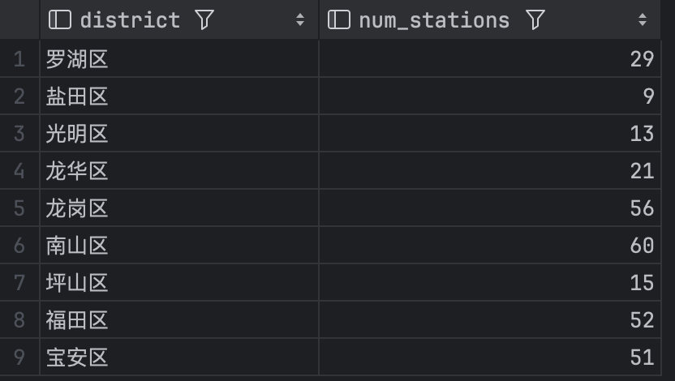<br/>
      
    </td>
    <td>
      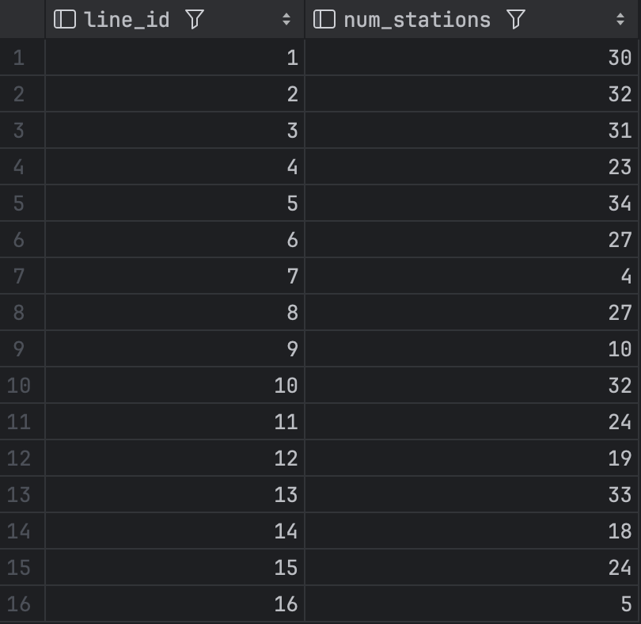
    </td>
  </tr>
</table>


##### Q2. Number of female passengers and male passengers respectively.


##### Q3. List the number of passengers from Mainland China, Hong Kong, Macau, and Taiwan.


##### Q4. (1) List the buses near a specific station exit.

(`entrance_id = 11`)

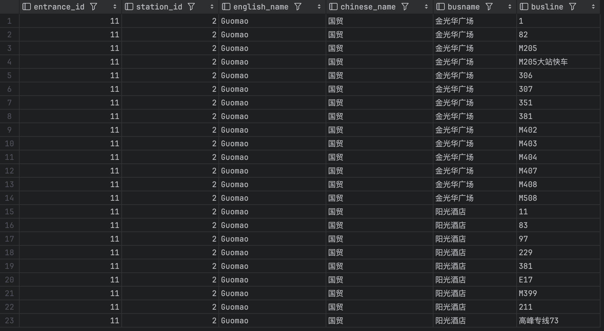

##### (2) List the buildings / landmarks near a specific station exit.

(`entrance_id = 10`)

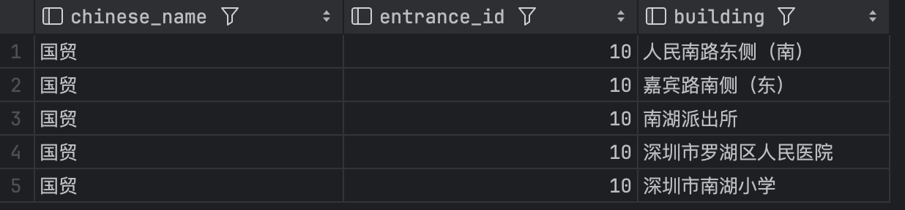

##### Q5. List all information about a specific passenger's journey, including passenger name, entry station, exit station, date, and time.

(`user_id_number = '140121195012160804'`)

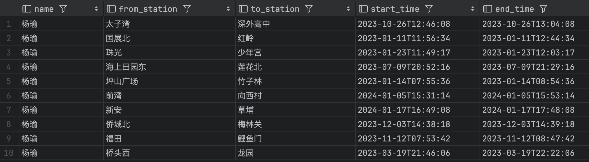

##### Q6. List all journey records for a specific travel card, including card number, entry station, exit station, date, and time.

(`card_number = '883545979'`)

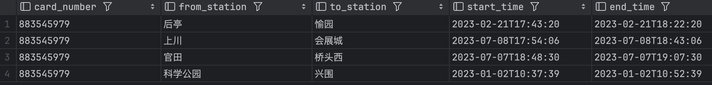

##### Q7. Query information about a specific subway station, including Chinese name, English name, number of exits, the district it is located in, and the subway line it belongs to.

(`station_id = 3`)


##### Q8. Query information about a specific subway line, including start time, end time, first opening time, number of stations, and an introduction.

(`line_id = 1`)


#### Task 3.3 Advanced requirements

##### 1. Try to **optimize your script**, and find **more than one ways** to import data, and provide a comparative analysis of the computational **efficiencies** between these ways.

我们使用多种方法试图优化，包括恒定Connection，引入Prepare Statement，引入Transaction机制，批量导入，多线程优化和在导入时Disable All Triggers的优化，共六条。

其中，前四条为Lab课上所提到的优化方式的实现，后两条为网络搜寻所发现；相关测试代码呈现在`/JavaLoaders/TestLoaders`中。为了方便比较，我们选用了多个表中的`Buildings`一表作为比较对象，共4706条数据。

以下测试，如无特殊说明，均使用此环境进行测试：

- MacBook Pro 14-inch 2021, Apple M1 Pro, 16GB RAM, 512GB SSD
- macOS Monterey 12.4, Intellij IDEA 2023.1.5, PostgreSQL 16

| 采用以下的输出形式                                           | 导入用时比较                                                 |
| ------------------------------------------------------------ | ------------------------------------------------------------ |
| 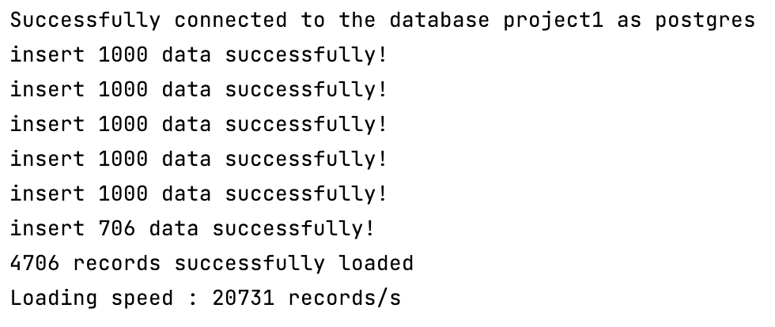 | 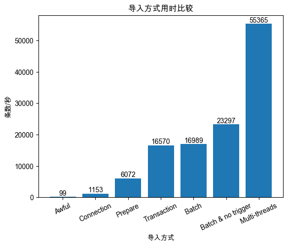 |

其中，Batch导入方式和Multi-threads导入方式均采取其中最优的方式：

- Batch导入采用`BATCH_SIZE=1000`。

- Multi-threads导入采用`THREADS=9, BATCH_SIZE=400`。

不难发现，各种导入方式速度逐渐得到提升，而最优的方式即为Multi-threads (With batches, no trigger)的方式，达到了55365条数/秒的高速。

所有的Batch导入尝试和Multi-threads导入尝试罗列如下：

| Batch导入尝试                                                | Multi-threads导入尝试：线程数为变量                          |
| ------------------------------------------------------------ | ------------------------------------------------------------ |
| 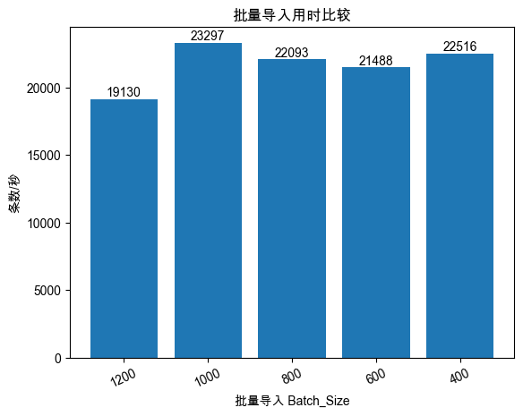 | 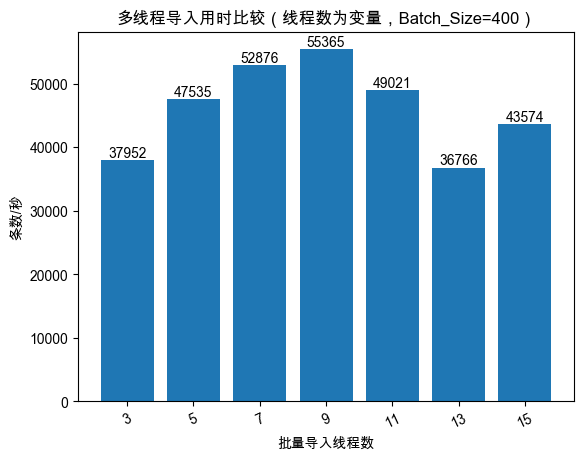 |

可以看到，过大或过小的Batch_Size，都不如适中的Batch_Size速度最快，可能因为这对于当前硬件条件是最合适的。

而对于多线程，可以看出在指定Batch_Size大小下，随着线程数增加，速度先变快后遇到瓶颈，这可能和这块SoC的核数相关。

此外，我们还在C++和Python导入时也使用多线程进行优化，效果如下：

| Language | Initial time | Optimized time | Multiple of optimization |
| -------- | ------------ | -------------- | ------------------------ |
| C++      | 28.428s      | 25.169s        | 1.13                     |
| Python   | 3.1017s      | 1.3472s        | 2.30                     |

而对于在导入时Disable Trigger的行为，我们也有所实践：

| Task                        | Initial time | Optimized time | Multiple of optimization |
| --------------------------- | ------------ | -------------- | ------------------------ |
| Java Full Loader            | 22.108s      | 19.683s        | 1.123                    |
| Java Batched Load Buildings | 0.277s       | 0.246s         | 1.126                    |

可以看出，通过Disable Trigger，就可以加快导入速度。当然，这么做的前提是所有数据已经经过前置检测，确认无误，否则可能导致数据库导入了错误的数据。

##### 2&4. Try to import data across multiple systems (e.g., Windows, MacOS, Linux). & Experiment with other databases; we recommend use **OpenGauss**.

在这一部分中，我们将这两个部分在一起描述，因为他们实际上高度相关。

我们进行了以下平台的测试：macOS + Postgres，macOS + MySQL，Windows + Postgres，Linux + OpenGauss，Linux + Postgres。

因此，对于第二点需求，我们实现了三个平台的测试：Windows，macOS，Linux。

对于第四点需求，我们实现了三个平台的测试：Postgres（基本），MySQL，OpenGauss。

其中，Windows测试的硬件环境为：

- HP Workstation, Intel Core i7-13700F, 24GB RAM, 1TB SSD
- Windows 11 22H2, Intellij IDEA 2023.3.2

而Linux测试在macOS平台中的虚拟机中进行，其环境为：

- MacBook Pro 14-inch 2021, Apple M1 Pro, 16GB RAM, 512GB SSD
- OpenEuler 22.03 LTS on Parallel Desktop 18, Intellij IDEA 2023.1.5
- Provide 4 cores, 4 GB RAM for virtual machine

通过SSH协议与母机通信，且通过Jsch库在IDEA中运行。

所有的测试结果如图所示：

| 多端全量导入比较                                             | Windows端多线程性能与macOS对比                               |
| ------------------------------------------------------------ | ------------------------------------------------------------ |
| 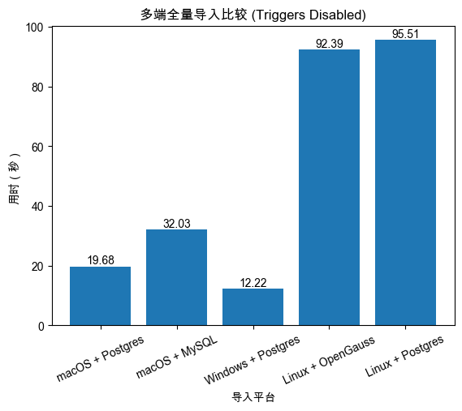 | 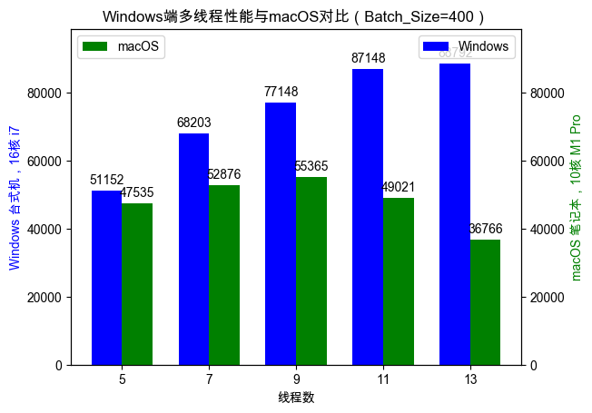 |

我们可以发现，Windows平台所用CPU性能最强，因此速度最高；而Linux为虚拟机环境，因此性能较低。

此外，我们发现Postgres具有比MySQL更高的性能，而在相同的Linux虚拟机环境（OpenEuler发行版）中，OpenGauss效率则略高于原生Postgres。

而当使用的线程数量持续上升时，MacBook迅速达到瓶颈，而Windows端却能持续提高表现；这主要是由于Windows台式机的CPU具有更多的核数和线程数。

此外，值得吐槽的是OpenGauss的安装和使用之艰难令人唏嘘，国产替代还是任重而道远啊！

##### 3. Try to import data using various programming languages (e.g., Java, Python, C++).

以下所有的测试都建立搭载在Apple M1 Pro芯片、16G内存，512GB SSD储存的Macbook Pro 14‘ 2021上。

| Language     | Total_Time（Total instruction = 134842） | Velocity（Instruction per second） |
| ---------------- | ------ | ----------- |
| C++ | 28.428s | 4743 |
| Python | 3.1017s | 43473 |
| Java | 19.683s | 6849 |
可以看到，Python库（psycopg2）默认即带有极强的优化；三种语言的普通SQL执行模式中，C++和Java速度相近，其中Java略快，而Python远快于另两种语言。

##### 5. Try to import data with different data volumes.

在这一部分中，我们自行生成了一组数据，可以自动生成指定数量的随机Stations，并插入相关数据表，进行压力测试。

可以看到，并没有产生明显的性能差异，具有很好的效果。

| N（总指令数） | 总时间 | 每秒插入指令数量 |
| ---- | ---- |---- |
| 1w | 0.44s | 27272 |
| 5w | 2.45s | 20408 |
| 10w | 5.53s | 18083 |
| 25w | 13.58s | 18409 |
| 50w | 24.14s | 20712 |

## 我们的项目报告到此结束，感谢您的阅读！