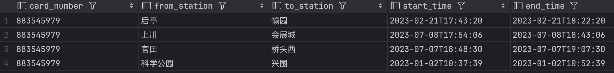

## SUSTech_CS307-DB_2024_Project1

#### 小组成员：陈明志 12211414，邱天润 12210829

> 源码托管于 GitHub，将在项目 ddl 结束后基于 **MIT License** 协议开源，访问链接：
>
> https://github.com/Dilemma-CMZ/CS307-Project1

------

### 成员分工及贡献百分比 (平均分配)

陈明志：

- Java 数据筛选与导入

- Python和C++数据导入框架与编写
- Python和C++部分多线程优化以及distrigger和entrigger的对比测试
- 不同的Data volume测试优化
- 项目相关的 SQL 语句编写
- 项目报告写作

邱天润：

- 

贡献百分比**相同，均为 50%**。

### 项目源码文件夹结构：（需要修改）

```shell
├─report.md
├─DDL.sql
├─C++_Loader.cpp
└─Python_Loader.py
└─SQLGenerator.java
└─Query.sql
├─Photo
├─Distinct Volume Test
│  ├─Definition.sql
│  ├─gen.cpp
│  └─load.py
├─JavaLoaders
│  ├─
│  ├─
│  └─
```

- [report.md](report.md) : 项目报告
- [DDL.sql](DDL.sql) : 每个库的基本信息
- [C++_Loader.cpp](C++_Loader.cpp) : C++导入数据源代码
- [Python_Loader.cpp](Python_Loader.cpp) : Python导入数据源代码
- [SQLGenerator.java](SQLGenerator.java) : 以5个json文件作为输入，可以输出所有的SQL建表语句以及数据的插入
- [Query.sql](Query.sql) : SQL查询语句
- [Photo](Photo/) : 储存所有项目所需的图片
- [Distinct Volume Test](Distinct Volume Test) : 
  - Definition.sql 进行测试之前需要运行的sql语句
  - gen.cpp数据生成器
  - load.py导入数据脚本


------

### Task 1: E-R Diagram

本小组使用 [drawio](https://www.diagrams.net/) 绘图工具，绘制本项目的 E-R 图，截图如下：


------

### Task 2: Relational Database Design

本项目使用 [`DDL.sql`](DDL.sql) 文件创建数据表，使用 `PostgreSQL` `DDL` 语法编写。

#### 数据库设计

使用 [`DataGrip`](https://www.jetbrains.com/datagrip/) 创建数据表并全选后通过右键 `Diagram > Show Diagram` 显示如下数据表设计及关系。


#### 设计思路及说明

##### 数据表及其各列含义说明

在整个项目中共创建了 11 个数据表，数据表和其中各列、外键的含义如下：

1. Lines 表存储地铁线路信息。包括地铁线的编号 Line_id（主键）、该地铁线路的起始时间 start_time、结束时间 end_time、介绍 intro、里程数 mileage、标注颜色 color、首次开通日期 first_opening、官方网址 url。

2. Stations 表存储地铁站点信息。包括站点编号 Station_id（主键）、英文名 English_name、中文名 Chinese_name、所在区域 District、简介 Introduction。

3. Line_details 表建立地铁线路和站点之间的关系。包括地铁线编号 Line_id（外键，参考 Lines.Line_id）、站点编号 Station_id（外键，参考 Stations.Station_id）、线路序号 line_num（表示站点在线路上的顺序）。

4. Entrances 表存储地铁站入口信息。包括入口编号 Entrance_id（主键）、站点编号 station_id（外键，参考 Stations.Station_id）、入口名称 Entrance_name。

5. Buildings 表存储与入口相关的建筑信息。包括建筑编号 Building_id、入口编号 Entrance_id（外键，参考 Entrances.Entrance_id）、入口名称 Entrance。

6. Bus_Names 表存储与入口相关的公交线路名称信息。包括公交线路名称编号 BusName_id（主键）、入口编号 Entrance_id（外键，参考 Entrances.Entrance_id）、公交线路名称 BusName。

7. Bus_Lines 表存储公交线路信息。包括公交线路编号 BusLine_id（主键）、公交线路名称编号 BusName_id（外键，参考 Bus_Names.BusName_id）、公交线路名称 BusLine。

8. Cards 表存储交通卡信息。包括卡号 Card_number（主键）、卡上的金额 Money、创建时间 Create_time。

9. Users 表存储用户信息。包括用户身份证号码 User_id_number（主键）、姓名 Name、电话号码 Phone、性别 Gender、所在区域 District。

10. User_Rides 表存储用户乘车信息。包括乘车编号 Ride_id（主键）、用户身份证号码 User_id（外键，参考 Users.User_id_number）、起始站点编号 From_station（外键，参考 Stations.station_id）、目的站点编号 To_station（外键，参考 Stations.station_id）、价格 Price、起始时间 Start_time、结束时间 End_time。

11. Card_Rides 表存储使用卡片的乘车信息。包括乘车编号 Ride_id（主键）、卡号 Card_id（外键，参考 Cards.Card_number）、起始站点编号 From_station（外键，参考 Stations.station_id）、目的站点编号 To_station（外键，参考 Stations.station_id）、价格 Price、起始时间 Start_time、结束时间 End_time。


##### 数据库构建的合理性

- 满足三大范式

  通过示意图可以看到，每个数据表的每一列都是不可分割的，仅有一个值。每个数据表都有主关键字，且主关键字都是 `UNIQUE` 的，其它数据元素能和主关键字一一对应。通过设计外键连接，我们将同一数据表中具有“传递”关系的数据列设计成不同的表格进行设计，不存在非关键字段对任一候选关键字段的传递函数依赖。可见，按以上设计思想设计的数据库满足三大范式的要求。

- 满足项目要求文档 所要求的其它详细注意点。

------

### Task 3: Data Import

#### Task 3.1 Basic Requirements（还需要补充）

| Script name      | Author | Description |
| ---------------- | ------ | ----------- |
| SQLGenerator.java   | 陈明志&邱天润 |   将Resources中的5个json文件作为输入，运行该脚本可以得到所有的建表语句以及插入内容的sql文件  |
| C++_Loader.cpp   | 陈明志 |  通过运行这个C++脚本可以导入所有的数据，并且里面有两种方式导入，一种是普通的导入，另外一种是通过控制互斥锁以及多线程优化后的导入（在Task 3.3.6中会有对比）     |
| Python_Loader.py | 陈明志 | 通过运行这个Python脚本可以导入所有的数据，并且里面有两种方式导入，一种是普通的导入，另外一种是运用Python`concurrent.futures`优化的多线程导入（在Task 3.3.6中会有对比）  |

在处理数据的过程中，我们通过创造了中间文件的方式来处理数据。我们首先使用`SQLGenerator.java`脚本将原始的JSON文件转换为SQL文件。这个脚本会读取JSON文件，然后生成相应的SQL语句（包括建表语句和插入数据的语句），并且会进行一定程度的数据清洗，比如对冗余的全角半角的空格进行的删除，以及对一些错误数据的人工纠正。生成的SQL文件是我们的中间文件，我们可以直接通过依次运行每一个sql来导入数据。当然也可以通过上述所说的Java、C++、Python中的任意一种脚本，通过直接运行脚本来导入数据。

#### Task 3.2 Data Accuracy checking

##### Q1. The numbrer of stations, in each district, on each line or in total.

<table style="width:100%">
  <tr>
    <td>
      
      
    </td>
    <td>
      
    </td>
  </tr>
</table>

##### Q2. Number of female passengers and male passengers respectively.


##### Q3. List the number of passengers from Mainland China, Hong Kong, Macau, and Taiwan.


##### Q4. (1) List the buses near a specific station exit.(`entrance_id = 11`)

.png)

##### (2) List the buildings / landmarks near a specific station exit.(`entrance_id = 10)

.png)

##### Q5. List all information about a specific passenger's journey, including passenger name, entry station, exit station, date, and time.(`user_id_number = '140121195012160804'`)


##### Q6. List all journey records for a specific travel card, including card number, entry station, exit station, date, and time.(`card_number = '883545979'`)



##### Q7. Query information about a specific subway station, including Chinese name, English name, number of exits, the district it is located in, and the subway line it belongs to.(`station_id = 3`)


##### Q8. Query information about a specific subway line, including start time, end time, first opening time, number of stations, and an introduction.(`line_id = 1`)


#### Task 3.3 Advanced requirements

1. Try to **optimize your script**, and find **more than one ways** to import data, and provide a comparative analysis of the computational **efficiencies** between these ways.
2. Try to import data across multiple systems (e.g., Windows, MacOS, Linux).
3. Try to import data using various programming languages (e.g., Java, Python, C++).
4. Experiment with other databases; we recommend use **OpenGauss**.
5. Try to import data with different data volumes.
6. Other advancements
   1. 多线程优化以及效率对比


